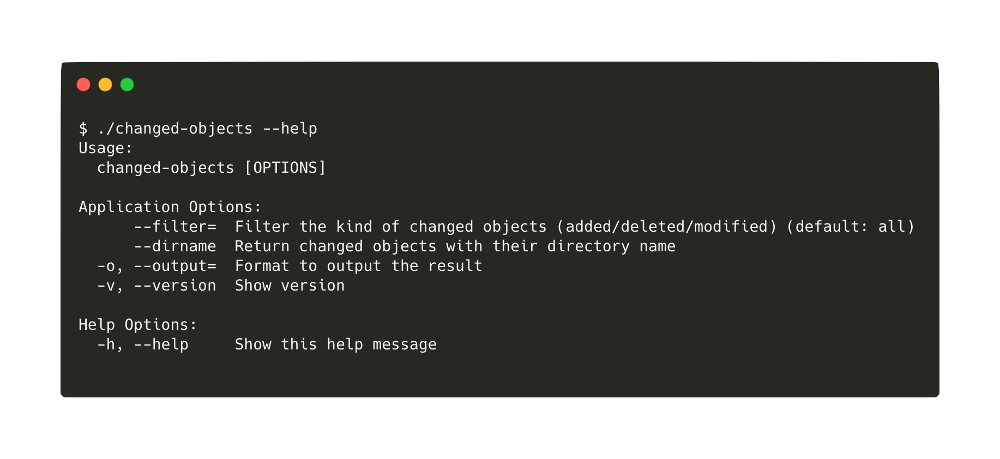

changed-objects
===============

Get changed objects in Git commit



## Usage

You can filter the type of changed objects. In this below example, only "added" and "modified" resources are filtered.

```console
$ changed-objects --filter=modified --filter=added
README.md
functions/_enhancd_filter_interactive.fish
functions/_enhancd_filter_join.fish
functions/_enhancd_source_default.fish
src/sources.sh
functions/_enhancd_entry_git_root.fish
src/entry.sh
```

You can get also them as JSON format.

```console
$ changed-objects --filter=modified --filter=added -o json
{"repo":"/Users/b4b4r07/src/github.com/b4b4r07/enhancd","stats":[{"kind":"modify","path":"README.md"},{"kind":"modify","path":"functions/_enhancd_filter_interactive.fish"},{"kind":"modify","path":"functions/_enhancd_filter_join.fish"},{"kind":"modify","path":"functions/_enhancd_source_default.fish"},{"kind":"modify","path":"src/sources.sh"},{"kind":"insert","path":"functions/_enhancd_entry_git_root.fish"},{"kind":"insert","path":"src/entry.sh"}]}
```

Besides, you can get them with their parent directory name if `--dirname` is given

```console
$ changed-objects --dirname --filter=deleted
.github
.github/workflows
```

## Installation

Download the binary from [GitHub Releases][release] and drop it in your `$PATH`.

- [Darwin / Mac][release]
- [Linux][release]

## License

[MIT][license]

[release]: https://github.com/b4b4r07/changed-objects/releases/latest
[license]: https://b4b4r07.mit-license.org
